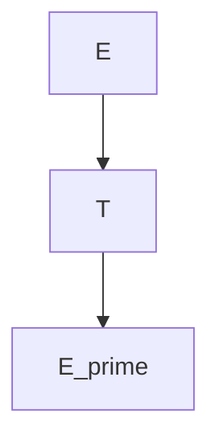
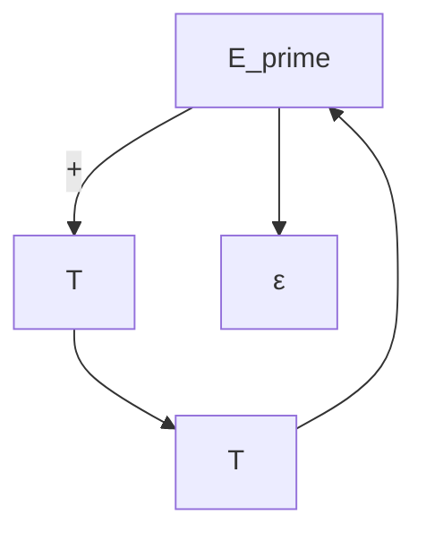
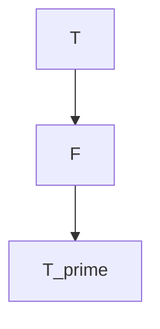
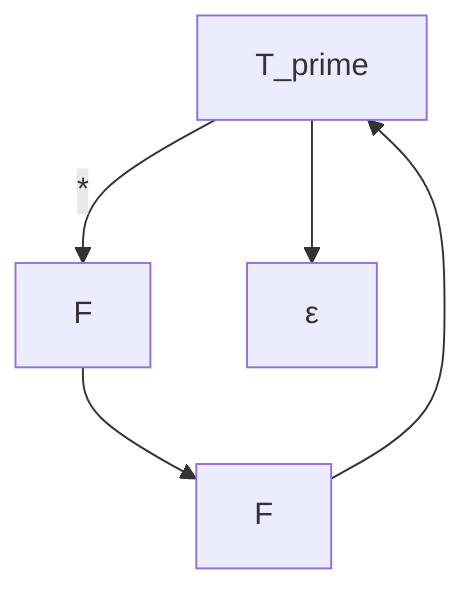
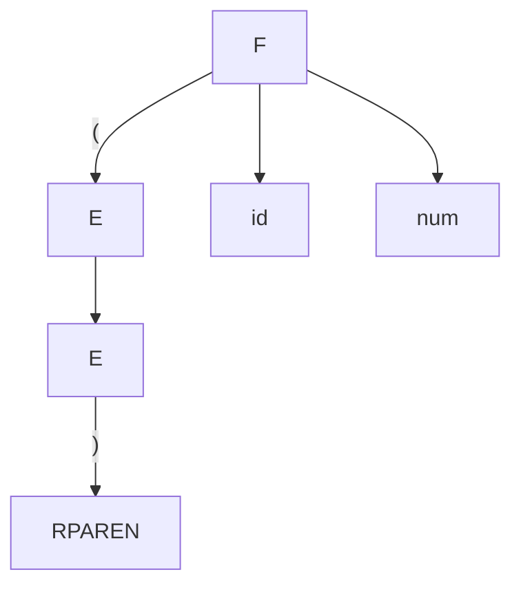

# Gramática de Expresiones Aritméticas

Esta gramática define expresiones aritméticas con suma y multiplicación, incluyendo paréntesis, identificadores y números.

## Producciones

- E → T E′
- E′ → + T E′ | ε
- T → F T′
- T′ → * F T′ | ε
- F → ( E ) | id | num

## Diagramas de Transición (Sintaxis Diagrams)

### E (Expresión)

### E′ (Prima de Expresión)

### T (Término)

### T′ (Prima de Término)

### F (Factor)
